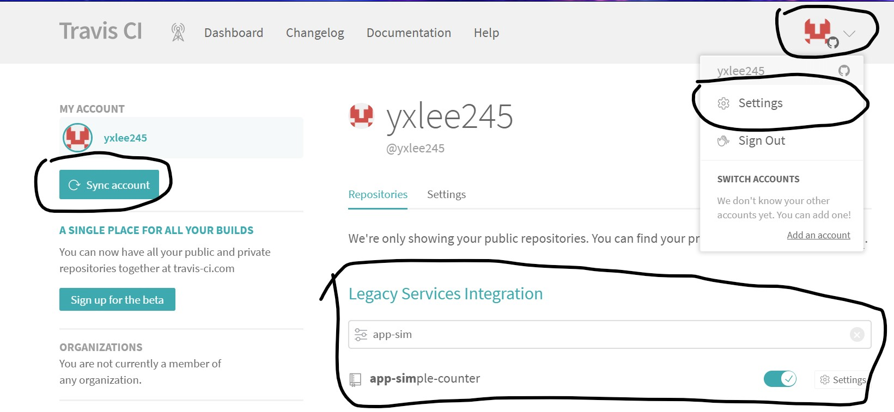
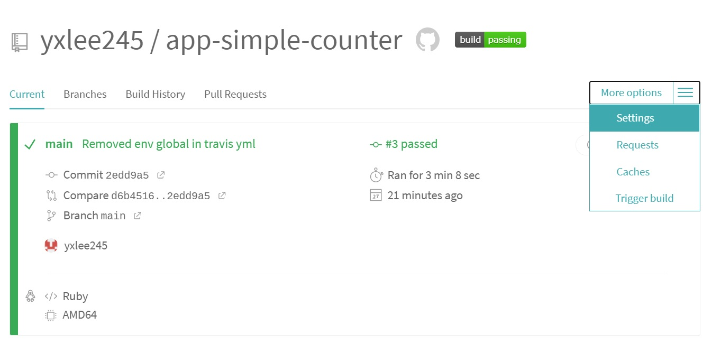
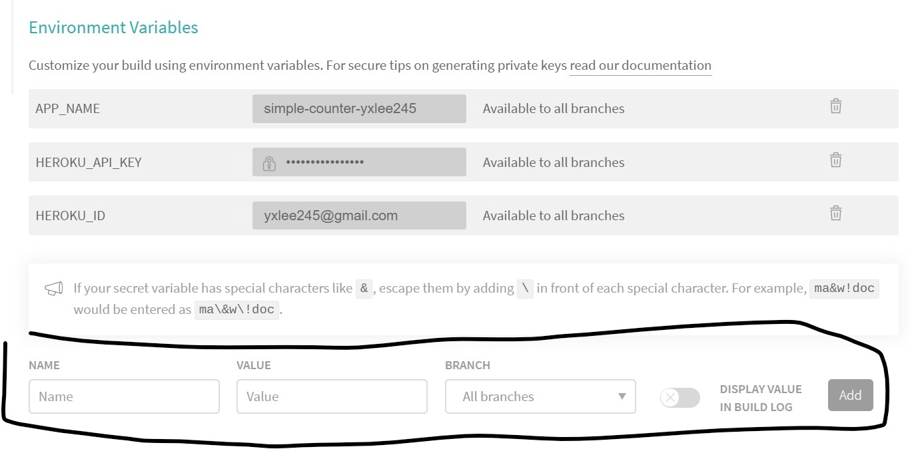
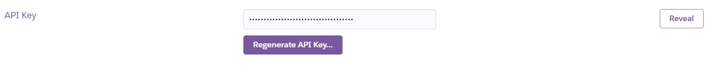
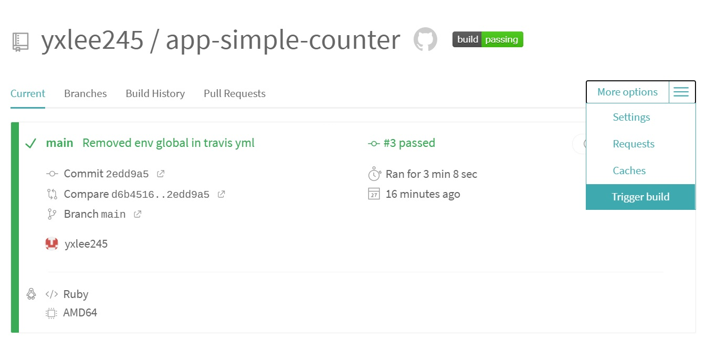
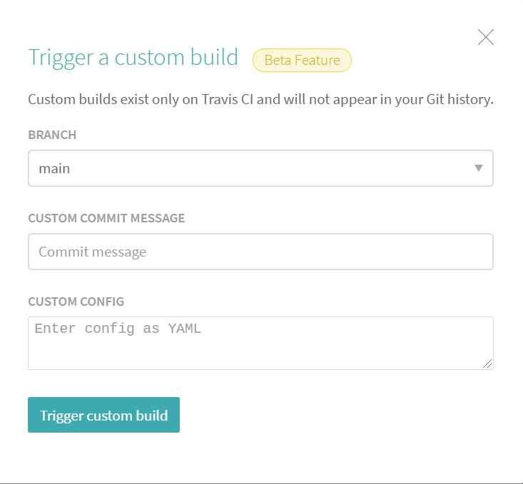
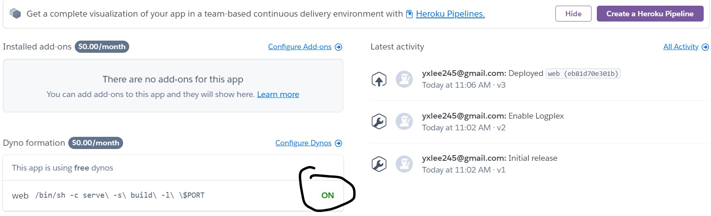
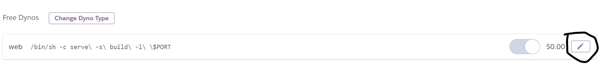
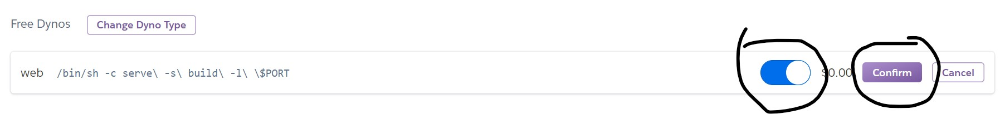

# Simple Counter App

## About this repo
The following is done in this repo:
- Creating a simple React app that does counting
- Packaging this app in a Docker container
- Deploying the container into Heroku via Travis CI

The deployed app can be viewed [here](https://simple-counter-yxlee245.herokuapp.com/)

## Reproducing this repo

### Prerequisites
If deploying to Heroku straight from repo:
- Travis CI account that is linked to your Github account
- Heroku account with a created empty app
If running container locally:
- Docker installed on local machine

## Deploying straight to Heroku from repo
1. Fork this repo
2. Sync the forked repo in Travis CI:
    - Go to "Settings" under the menu at the top right corner of the main page
    - Click "Sync Account"
    - Search for "app-simple-counter" repo by using the Filter Repository box, then click on the slider to integrate the repo with Travis CI. The slider should be green, as shown in the image below
    
3. Click on "app-simple-counter" shown in image above to get to the repo dashboard
4. Click "More options", then click "Settings"
    
5. Add environment variables APP_NAME, HEROKU_API_KEY and HEROKU_ID. HEROKU_ID is the email address used to sign in to your Heroku account, while HEROKU_API_KEY can be found in https://dashboard.heroku.com/account. You'll need to click "Reveal" to show your Heroku API key before you can copy and paste it in Travis CI
    
    
6. Click "More options", then click "Trigger build"
    
7. In the pop-up, type in any commit message if desired (optional), and click "Trigger custom build".
    
8. Go to Heroku App Dashboard at https://dashboard.heroku.com/apps/(app-name) and check if the Dynos for the web process is On. If not, click "Configure Dynos", click on the Pen icon, turn the slider to On, then click "Confirm".
    
    
    

If everything is done right, you should be able to view the app in "https://(app-name).herokuapp.com".

## Deploying the Docker container locally
1. Fork this repo, then run the following commands to clone the forked repo into the desired working directory
```
cd /path/to/directory
git clone <repo URL>
cd app-simple-counter
```
2. Build the Docker image
```
docker build -t <tag-name> ./client
```
3. Run the Docker image
```
docker run -p 3000:3000 -e PORT=3000 <tag-name>
```

The app can be viewed in http://localhost:3000 if using Docker Desktop, or 192.168.99.100:3000 if using Docker Toolbox.